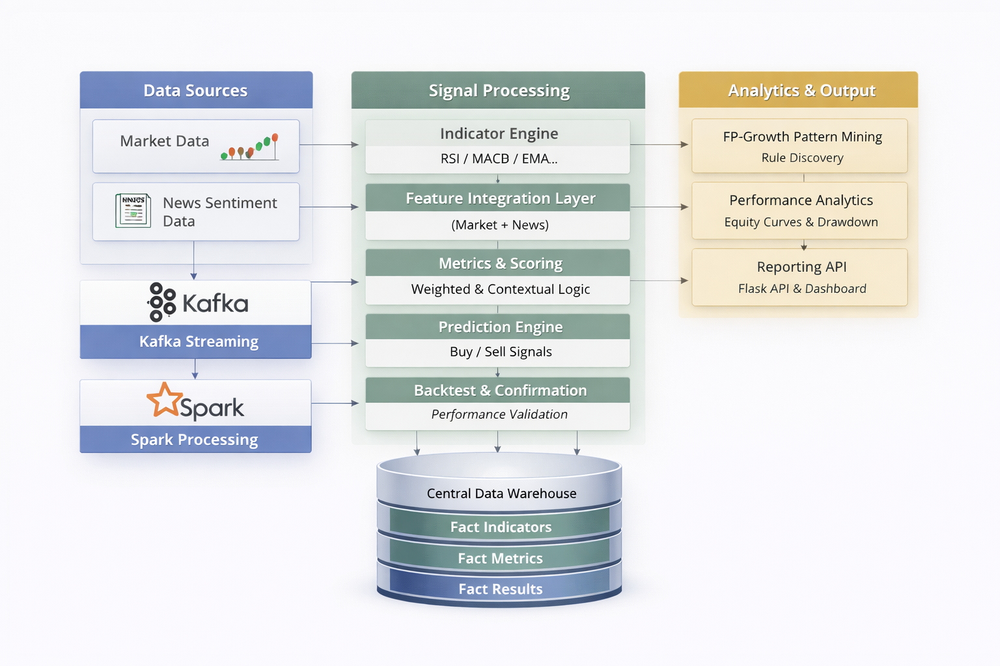

# 🚀 Deterministic Quantitative Trading Research Platform  
### Production-Grade Crypto Data Pipeline with Structured Edge Validation  

### Data Engineering Capstone Project  
**Author:** Nguyễn Ngọc Nam  
**Mentor:** Phạm Long Vân - Data Manager

**Location:** Ho Chi Minh City, Vietnam — 2025  

---

# 1️⃣ Introduction

This project designs a structured, scalable, and empirically testable quantitative trading research framework. It standardizes the full lifecycle of a trading signal—from real-time market ingestion, technical indicator computation, and metric abstraction, to deterministic prediction and independent confirmation—while strictly separating processing layers to prevent data leakage.

Instead of relying on opaque machine learning models, the system implements a weighted, metric-driven scoring engine based on the concept of **edge**, allowing transparent evaluation of directional dominance between buyers and sellers. The architecture follows a fact-driven Data Warehouse design with explicit grain definition, idempotent ETL processes, and full signal traceability. Structural pattern mining (FP-Growth) is applied to validated trades to assess edge sustainability. The framework prioritizes transparency, reproducibility, and experimental rigor over short-term optimization.

---

# 2️⃣ System Outputs & User Value

This platform delivers multiple layers of value to quantitative researchers and trading system developers:

## 1. Explainable Trading Signals
- Deterministic BUY / SELL decisions  
- Edge and confidence scoring  
- Full transparency of contributing metrics  
- No black-box logic  

## 2. Controlled Performance Evaluation
- Leakage-safe confirmation framework  
- Adaptive TP/SL risk modeling  
- Expectancy, drawdown, rolling stability analysis  
- Equity curve simulation  

## 3. Structural Market Insights
- Regime-dependent performance segmentation  
- FP-Growth structural pattern mining  
- Lift-based edge validation  
- Identification of recurring market conditions  

## 4. Scalable Research Infrastructure
- Warehouse-driven experimentation  
- Configurable metric logic  
- DAG-based orchestration  
- Fully reproducible signal lifecycle  

The system transforms raw market data into structured trading intelligence while maintaining transparency, scalability, and experimental control.

---

# 3️⃣ System Architecture



The system follows a layered architecture separating ingestion, transformation, signal modeling, orchestration, validation, and analytics.

---

## 1. Data Ingestion

- Kafka streams real-time OHLCV market data  
- Spark Streaming processes and normalizes records  
- Clean data stored in `fact_kline`  

---

## 2. Indicator Computation

- Atomic indicators computed via Spark  
- Stored independently in `fact_indicator`  
- Partitioned by symbol and interval  

---

## 3. Metric Abstraction

- Trading conditions defined in `dim_metric`  
- Evaluated into `fact_metric_value`  
- Threshold, trend, cross, volatility logic  

---

## 4. Prediction Engine

- Independent BUY / SELL scoring  
- Edge and confidence calculation  
- Stored in `fact_prediction`  

---

## 5. Backtesting & Confirmation

- Adaptive TP/SL within controlled lookahead  
- Stored in `fact_prediction_result`  
- Strict leakage prevention  

---

## 6. Orchestration Layer (Apache Airflow)

The entire workflow is coordinated using **Apache Airflow DAGs** running in a Linux environment.

- Dependency-controlled Spark job execution  
- Scheduled metric, prediction, and confirmation tasks  
- Retry and failure handling  
- Modular DAG structure  
- CeleryExecutor for distributed execution  

Airflow ensures reproducible, production-ready orchestration across all pipeline layers.

---

## 7. Analytics & Pattern Mining

- Equity curve and expectancy metrics  
- Regime-based performance analysis  
- FP-Growth structural mining  
- Flask API for analytics endpoints  

---

# 4️⃣ Data Warehouse Design


Fact-driven layered model with explicit grain definition.

## Core Dimensions

- `dim_symbol`
- `dim_interval`
- `dim_indicator_type`
- `dim_metric`

## Fact Layers

| Table                    | Grain                                      | Role |
|--------------------------|--------------------------------------------|------|
| `fact_kline`             | (symbol, interval, close_time)             | Market data |
| `fact_indicator`         | (symbol, interval, indicator, timestamp)   | Atomic signals |
| `fact_metric_value`      | (symbol, interval, metric, calculating_at) | Logical conditions |
| `fact_prediction`        | (symbol, interval, predicting_at)          | Trading hypothesis |
| `fact_prediction_result` | (prediction_id)                            | Realized outcome |

---

# 5️⃣ Indicator Engineering

Indicators stored at atomic grain:

(symbol_id, interval_id, indicator_type, timestamp)

- Spark window-based computation  
- Partitioned distributed processing  
- Fully recomputable from raw kline  

---

# 6️⃣ Metric Abstraction Layer

Config-driven trading logic defined in database.

- Anchor indicator  
- Threshold range  
- Direction rule  
- Window size  
- Weight  

Evaluated into `fact_metric_value`.

---

# 7️⃣ Prediction Engine

buy_score  = Σ(weighted BUY metrics)  
sell_score = Σ(weighted SELL metrics)  

edge = |buy_score − sell_score|  
confidence = max(score) / MAX_SCORE  

Stored in `fact_prediction`.

---

# 8️⃣ Backtesting & Confirmation Framework

- Controlled lookahead window  
- Adaptive TP/SL  
- Idempotent result writing  
- Strict leakage prevention  

---

# 9️⃣ Analytics & Performance Evaluation

- Win Rate  
- Expectancy  
- Rolling stability  
- Equity curve  
- Drawdown  
- FP-Growth structural validation  

---

# 🔟 Tech Stack & Engineering Practices

## Tech Stack

- Python  
- PySpark  
- Apache Kafka  
- Apache Airflow (CeleryExecutor)  
- Spark ML (FPGrowth)  
- MySQL 8  
- Flask  
- NumPy / Pandas  

## Deployment Environment

The system is deployed and executed on a **Linux-based environment** with:

- Apache Kafka running as service  
- Apache Spark cluster  
- Apache Airflow scheduler + workers  
- MySQL database server  
- Flask API service  

Services are configured and managed directly at the OS level without containerization.

---

## Engineering Practices

- Layered architecture  
- Explicit grain control  
- Fact-driven warehouse modeling  
- Idempotent ETL  
- UTC normalization  
- Distributed Spark computation  
- Config-driven strategy logic  
- Strict prediction/confirmation separation  
- DAG-based workflow orchestration  
- Linux service-level deployment  

---

# 11️⃣ Conclusion

This project establishes a deterministic quantitative research infrastructure grounded in structured data modeling and strict leakage control.

By decoupling ingestion, signal construction, confirmation, and evaluation into independent layers, the system enforces reproducibility, auditability, and disciplined experimentation. Every stage of the signal lifecycle is persisted at explicit grain within a fact-driven warehouse, reducing ambiguity and preventing implicit assumptions.

The framework is designed as a foundation rather than a single strategy implementation. Its architecture allows controlled expansion toward portfolio-level allocation models, transaction cost integration, regime-adaptive signal weighting, and hybrid deterministic–statistical extensions, while preserving transparency and structural integrity.

The primary objective is not short-term optimization, but the construction of a research environment where edge can be measured, validated, and stress-tested under controlled conditions.
# 📂 Project Structure

---

```text
crypto-quant-platform/
│
├── dags/                         # Airflow DAG definitions
│   ├── crypto_pipeline_dag.py
│   ├── news_pipeline_dag.py
│   └── ...
│
├── kafka/
│   ├── producer_prices.py
│   ├── producer_news.py
│   ├── consumer_prices.py
│   └── consumer_news.py
│
├── spark_jobs/
│   ├── staging_to_fact.py
│   ├── indicator_job.py
│   ├── metric_job.py
│   ├── prediction_engine.py
│   ├── backtest_engine.py
│   └── fp_growth_job.py
│
├── indicators/
│   ├── momentum.py
│   ├── trend_filter.py
│   ├── trend_strength.py
│   ├── volatility.py
│   └── volume.py
│
├── sql/
│   ├── dim_tables.sql
│   ├── fact_tables.sql
│   └── metric_definitions.sql
│
├── app/
│   └── app.py
│
├── config/
│   └── config.py
│
├── requirements.txt
└── README.md


