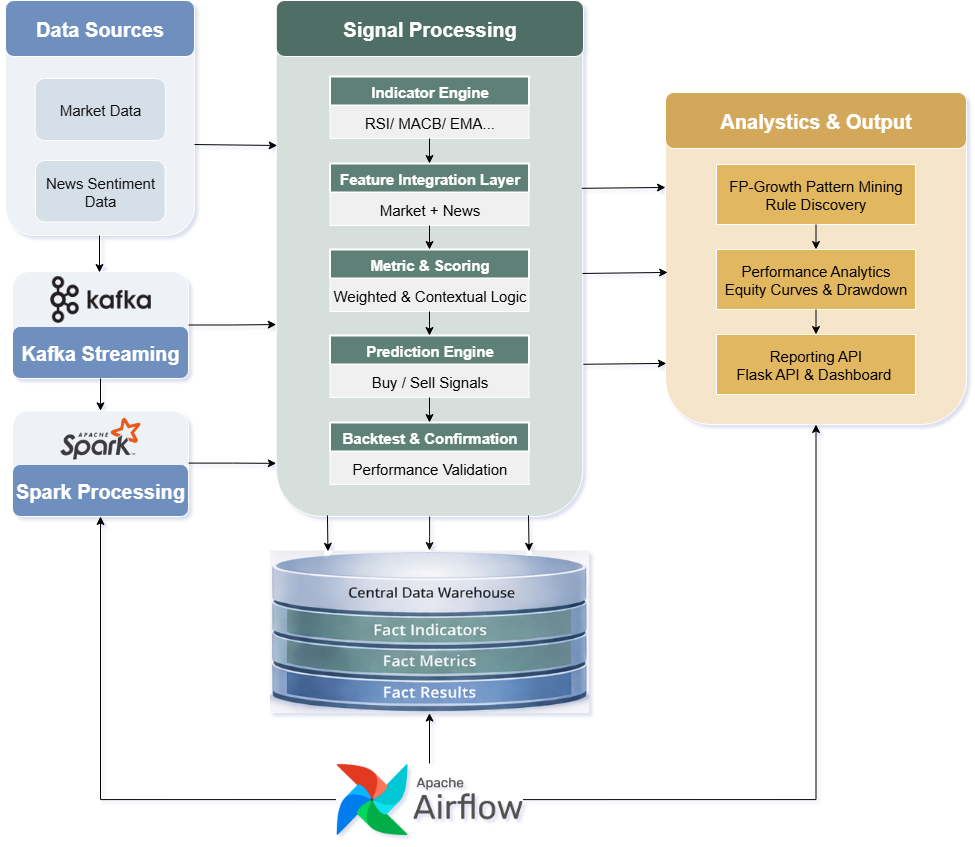
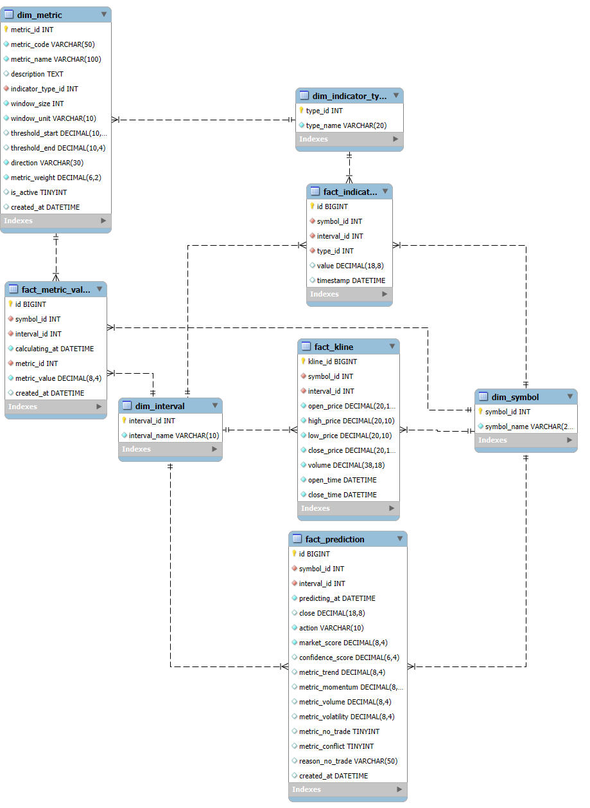
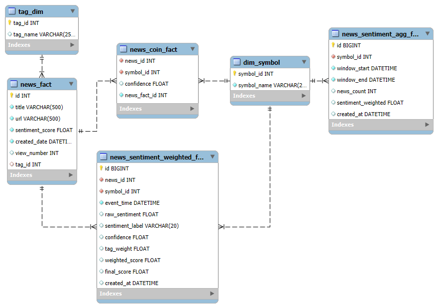
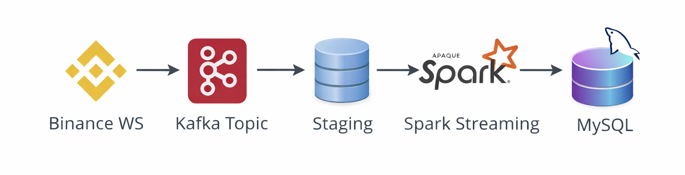
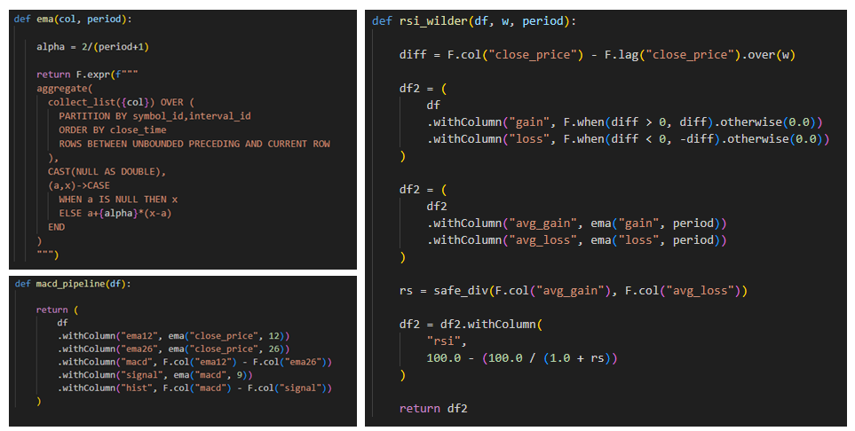
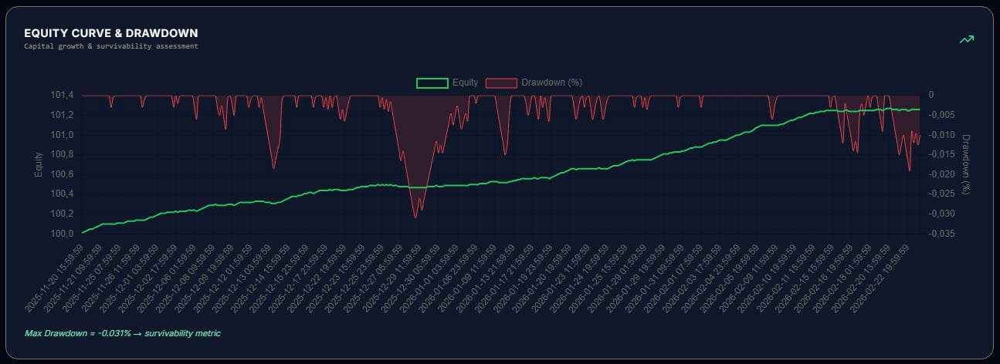
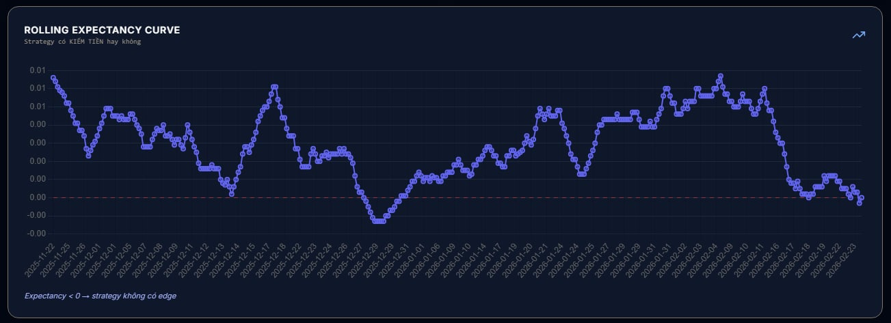
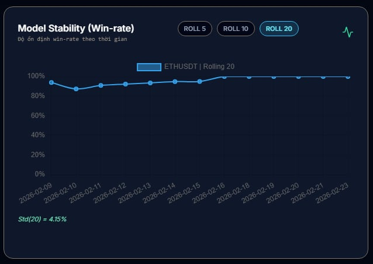
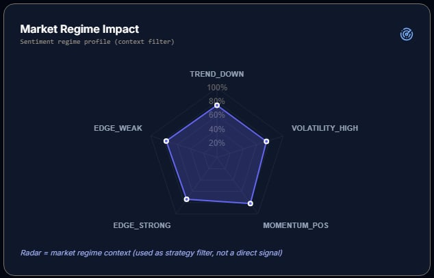
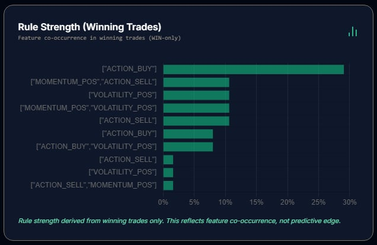

# 🚀 Crypto Quantitative Research & Real-Time Data Platform (Production-Grade) 
### Hệ Thống Phân Tích & Dự Đoán Tài Sản Số Dựa Trên Dữ Liệu Thời Gian Thực  

**Author:** Nguyễn Ngọc Nam  
**Mentor:** Phạm Long Vân - Data Manager  
**Location:** Ho Chi Minh City, Vietnam - 2026

---

# 🌍 Bối Cảnh Thị Trường & Nhu Cầu Thực Tế

Trong những năm gần đây, tài sản số như BTC, ETH và BNB đang dần trở thành một lớp tài sản có thanh khoản cao và thu hút sự tham gia mạnh mẽ của nhà đầu tư cá nhân lẫn tổ chức. Tuy nhiên, đặc thù của thị trường crypto là biến động lớn, phản ứng nhạy với tin tức và thường xuyên xuất hiện nhiễu tín hiệu ngắn hạn. Phần lớn quyết định giao dịch vẫn dựa trên cảm tính hoặc quan sát rời rạc, thiếu một hệ thống định lượng có khả năng kiểm chứng và đánh giá hiệu suất dài hạn.

Trong bối cảnh tài sản số ngày càng được quan tâm và có xu hướng được quản lý chính thức, nhu cầu về một nền tảng phân tích dữ liệu thời gian thực, minh bạch và có cơ sở thống kê trở nên cấp thiết. Một hệ thống như vậy không chỉ cần thu thập và xử lý dữ liệu liên tục, mà còn phải tổ chức dữ liệu theo chuẩn Data Warehouse, xây dựng mô hình scoring rõ ràng, và đánh giá chiến lược bằng các chỉ số hiệu suất có thể truy vết.

Dự án này được xây dựng nhằm giải quyết bài toán đó. Thay vì tập trung vào dự đoán ngắn hạn đơn lẻ, hệ thống hướng tới việc thiết kế một hạ tầng dữ liệu hoàn chỉnh — từ ingestion, xử lý phân tán, lưu trữ chuẩn hóa, modeling, đến phân tích hiệu suất — nhằm cung cấp góc nhìn định lượng có thể kiểm chứng và mở rộng.

---

## 📌 Tóm Tắt Điều Hành (Executive Summary)

Đây là một nền tảng xử lý dữ liệu và nghiên cứu định lượng được thiết kế theo định hướng production, với mục tiêu:

- Thu thập dữ liệu thị trường crypto theo thời gian thực
- Chuẩn hóa và tổ chức dữ liệu theo mô hình Data Warehouse (Dim-Fact)
- Xây dựng hệ thống chấm điểm (scoring) tín hiệu giao dịch có tính xác định (deterministic)
- Backtest và đánh giá độ ổn định chiến lược
- Khai phá pattern giao dịch thắng bằng FP-Growth
- Trình diễn phân tích qua Dashboard

Hệ thống được xây dựng với tư duy:

- Scalability (khả năng mở rộng)
- Idempotency (chạy lại không trùng lặp)
- Fault tolerance (chịu lỗi)
- Traceability (truy vết dữ liệu)
  
Link demo: https://ngocnam-de-project.hocnghiepvu.com

---

# 1️⃣ Kiến Trúc Tổng Thể Hệ Thống

## 🏗 System Architecture

Hệ thống gồm 5 tầng:

### 🔹 Tầng Thu Thập Dữ Liệu
- Binance WebSocket / API
- News Crawler
- Kafka Streaming

### 🔹 Tầng Xử Lý
- Spark (Batch & Streaming)
- Indicator Engine
- Metric & Scoring Engine
- Backtest Engine
- FP-Growth Mining

### 🔹 Tầng Lưu Trữ
- MySQL Data Warehouse (Dim-Fact)

### 🔹 Tầng Điều Phối
- Airflow DAG
- Retry & Failure Handling
- Idempotent Job Execution

### 🔹 Tầng Trình Diễn
- Flask API
- Dashboard phân tích

---

# 2️⃣ Kiến Trúc Data Warehouse

Sau khi xác định kiến trúc tổng thể, bước quan trọng nhất là thiết kế Data Warehouse để toàn bộ dữ liệu được tổ chức có cấu trúc và có khả năng mở rộng.

## 🧱 2.1 Mô Hình Dim–Fact

### 🎯 Nguyên tắc thiết kế

- Xác định rõ **Data Grain** cho từng Fact
- Tách biệt Context (Dimension) và Event (Fact)
- Đảm bảo khả năng mở rộng khi thêm tài sản hoặc metric
- Tối ưu truy vấn phân tích theo thời gian

---

## 📌 2.2 Thiết Kế Fact Chính

### `fact_kline`
- Grain: (symbol_id, interval_id, open_time)
- Lưu dữ liệu OHLCV chuẩn hóa

### `fact_indicator`
- Grain: (symbol_id, interval_id, indicator_type_id, open_time)
- Lưu giá trị indicator atomic

### `fact_metric_value`
- Grain: (symbol_id, metric_id, open_time)
- Lưu kết quả đánh giá điều kiện giao dịch

### `fact_prediction`
- Grain: (symbol_id, interval_id, signal_time, signal_type)
- Lưu tín hiệu BUY/SELL/SIDEWAY

### `fact_prediction_result`
- Tách riêng khỏi prediction để đảm bảo:
  - Không rò rỉ dữ liệu
  - Backtest leakage-safe
  - Tách biệt tầng signal và tầng validation

---

## 📰 2.3 Pipeline Sentiment Nhiều Lớp

Sentiment được thiết kế thành 4 lớp:

1. `news_fact` (Raw Article)
2. `news_coin_fact` (Mapping Symbol)
3. `news_sentiment_weighted_fact` (Weighted Score)
4. `news_sentiment_agg_fact` (Aggregation theo window)

Thiết kế này đảm bảo:

- Có thể truy vết từ aggregated → raw
- Có thể tái tính toán khi thay đổi trọng số
- Tách biệt trách nhiệm xử lý

---

## Vì Sao Chọn Dim-Fact?

- Tách biệt context và event
- Tối ưu truy vấn phân tích
- Lưu trữ lịch sử rõ ràng
- Dễ mở rộng metric mới
- Phù hợp chuẩn Data Warehouse
- Hỗ trợ phân tích theo thời gian và theo tài sản

---

# 3️⃣ Thiết Kế & Xây Dựng Hệ Thống 

## 3.1 Ingestion Layer

- Kafka giúp tách biệt producer & consumer
- Hỗ trợ replay dữ liệu
- Có thể scale ngang khi volume tăng
- Giảm phụ thuộc trực tiếp vào nguồn API

## 3.2 Indicator Computation

- RSI, MACD, EMA, ATR, ADX, BB, OBV
- Partition theo symbol
- Fully recomputable từ raw kline

---

## 3.3 Metric Abstraction

| metric_code | Logic | Direction | Weight |
|-------------|--------|-----------|--------|
| BTC_ADX_STRONG_2H | ADX ≥ 20 | ABOVE | 1.00 |
| BTC_BUY_MACD_BULL_2H | MACD > Signal | CROSS_UP | 1.30 |
| BTC_BUY_RSI_BULL_2H | RSI > 50 | ABOVE | 1.00 |
| BTC_BUY_VOL_OK_2H | BB_WIDTH ≥ 0.03 | ABOVE | 0.80 |
| BTC_SELL_TREND_DOWN_2H | EMA200 dốc xuống | TREND_DOWN | 1.20 |
| BTC_SELL_ADX_WEAK_2H | ADX < 20 | BELOW | 1.00 |
| BTC_SELL_MACD_BEAR_2H | MACD < Signal | CROSS_DOWN | 1.30 |
| BTC_SELL_MACD_HIST_DOWN_2H | MACD_HIST giảm | TREND_DOWN | 1.20 |
| BTC_SELL_RSI_BEAR_2H | RSI < 45 | BELOW | 1.00 |
| BTC_SELL_FAIL_BB_UP_2H | Giá reject BB_UP | REJECT | 0.90 |
       
- `dim_metric` định nghĩa điều kiện giao dịch
- Hỗ trợ:
  - Threshold logic
  - Cross logic
  - Trend logic
  - Volatility logic
 
---

## 3.4 Prediction Engine

buy_score  = Σ(weighted BUY metrics)  
sell_score = Σ(weighted SELL metrics)  

edge = |buy_score − sell_score|  
confidence = max(score) / MAX_SCORE  

- Conflict detection
- No-trade filter
- Confidence band filter

---

## 3.5 Anti-Duplicate & Idempotent Design

- Left-anti join trước khi ghi DB
- Kiểm soát duplicate write
- Replay-safe

---

## 3.6 Backtesting

- Tách prediction và result
- TP/SL adaptive
- Controlled lookahead window
- Rolling validation

---

# 4️⃣ Orchestration & Điều Phối

Hệ thống được điều phối bằng Airflow:

- Multi-coin parallel branch (BTC / ETH / BNB)
- Retry policy
- Failure recovery
- Isolated job execution

Thiết kế đảm bảo:

- Job crash không làm sập toàn hệ thống
- Có thể chạy lại mà không trùng dữ liệu

---

# 5️⃣ Data Understanding (EDA) & Data Dictionary Reasoning

Việc thu thập dữ liệu trong hệ thống không chỉ mang tính kỹ thuật mà dựa trên cơ chế hình thành giá và hành vi thị trường crypto.

## 🔹 Market Data (OHLCV)

| Trường dữ liệu | Lý do thu thập | Vai trò trong mô hình |
|---------------|---------------|------------------------|
| Open / Close  | Xác định cấu trúc nến | Đo động lượng |
| High / Low    | Đo biên độ dao động | Phân tích volatility |
| Volume        | Đo sức mạnh dòng tiền | Xác nhận tín hiệu |
| Timestamp     | Phân tích theo chu kỳ | Phân tích regime |

OHLCV là nền tảng của mọi phân tích kỹ thuật. Nếu không chuẩn hóa theo timeframe, mọi indicator sẽ mất ý nghĩa.

---

## 🔹 Momentum Indicators (RSI, MACD)

### RSI
- Đo trạng thái quá mua/quá bán
- Phát hiện khả năng đảo chiều

### MACD
- Đo sự hội tụ/phân kỳ trung bình động
- Phát hiện chuyển pha động lượng

Crypto thường xuất hiện pha biến động mạnh, do đó RSI & MACD rất phù hợp để đo momentum.

---

## 🔹 Trend Indicators (EMA, ADX)

### EMA
- EMA200: xu hướng dài hạn
- EMA20/50: xu hướng trung & ngắn hạn

### ADX
- Đo cường độ xu hướng
- Phân biệt trending và sideway

Giúp tránh giao dịch ngược xu hướng chính.

---

## 🔹 Volatility Indicators (BB, ATR)

Crypto có chu kỳ:
- Volatility squeeze
- Volatility expansion

BB đo độ mở biên  
ATR hỗ trợ thiết lập Stop Loss

---

## 🔹 Volume-Based Metrics

Volume xác nhận tín hiệu:

- Breakout không có volume → false breakout
- Divergence volume → dấu hiệu suy yếu

---

## 🔹 News & Sentiment

Crypto phản ứng mạnh với:
- Regulation
- ETF
- Exchange hack
- Macro event

Sentiment được sử dụng để bổ sung yếu tố tâm lý vào hệ thống scoring.

---

## 🎯 Mục tiêu EDA

- Xác định indicator đóng góp vào Win Rate
- Loại bỏ metric không có ý nghĩa thống kê
- Tối ưu trọng số scoring
- Giảm overfitting
- Cải thiện độ ổn định dài hạn

---

# 6️⃣ Framework Modeling & Scoring

## 🧮 Market Scoring

Market Score =  Trend + Momentum + Volume + Volatility

Confidence Score =  Market Score / Max Score

### Cơ Chế Bảo Vệ (Guard)

- Conflict Detection
- Weak Edge Filter
- Confidence Band Filter
- No-Trade Logic

Mục tiêu:

- Tránh overtrading
- Hạn chế false signal
- Giảm nhiễu trong regime squeeze
- Duy trì tính ổn định chiến lược

---

# 7️⃣ Backtest & Quản Trị Rủi Ro

Backtest đánh giá:

- TP / SL động
- Lookahead window
- Win/Loss classification
- PnL normalization
- Rolling expectancy
- Phân tích theo regime

Đảm bảo:

- Kiểm tra tính sống sót (survivability)
- Phát hiện suy giảm edge
- Tránh overfitting
- Đánh giá hiệu suất dài hạn

---

# 8️⃣ Phân Tích Hiệu Suất & Kiểm Chứng

## 📈 Equity Curve & Drawdown

Mục tiêu: Đánh giá khả năng tăng trưởng vốn và kiểm soát rủi ro.
- Đường equity thể hiện tăng trưởng lũy kế sau mỗi giao dịch.
- Drawdown giúp đo mức suy giảm tối đa.
- Dùng để kiểm tra tính bền vững dài hạn của chiến lược.

---

## 📉 Rolling Expectancy

Mục tiêu: Kiểm tra edge theo thời gian.
- Expectancy dương ổn định → chiến lược có lợi thế thống kê.
- Giảm liên tục → dấu hiệu regime change.
- Giúp phát hiện giai đoạn chiến lược mất hiệu quả.

---

## 📊 Rolling Winrate

Mục tiêu: Đánh giá tính ổn định của tín hiệu.
- Winrate không nên quá biến động.
- Nếu dao động mạnh → chiến lược phụ thuộc regime.
- Dùng để đánh giá robustness.

---

## 📡 Market Regime Radar

Mục tiêu: Hiểu trạng thái thị trường tại thời điểm tín hiệu.
- Phân tích trend strength, volatility, momentum alignment.
- Giúp giải thích tại sao tín hiệu hoạt động tốt hoặc kém hiệu quả.

---

## 📉 Price Regression

Mục tiêu: Đánh giá bias xu hướng và hành vi mean reversion.
- Độ dốc regression phản ánh xu hướng trung hạn.
- So sánh deviation để nhận diện vùng quá mua/quá bán.

---

## 📊 FP-Growth Rule Mining

Mục tiêu: Khai phá pattern giao dịch thắng.

- Support đo tần suất xuất hiện.
- Confidence đo xác suất điều kiện → kết quả.
- Lift đo mức cải thiện so với ngẫu nhiên.

---

# 9️⃣ Yếu Tố Production

Hệ thống được thiết kế để:

- Có thể chạy lại không trùng dữ liệu
- Retry khi job lỗi qua Airflow
- Phân tách xử lý theo coin
- Hỗ trợ mở rộng thêm tài sản
- Kiểm soát duplicate bằng left-anti join
- Cấu hình metric bật/tắt linh hoạt
- Theo dõi và truy vết toàn bộ pipeline

---

# 🔟 Giá Trị Đạt Được

Việc thiết kế và triển khai hệ thống này không chỉ dừng lại ở việc xây dựng một nền tảng phân tích crypto, mà còn giúp tôi nâng cấp toàn diện về kiến thức domain, năng lực kỹ thuật và tư duy hệ thống.

## 📊 1. Kiến Thức Domain Tài Chính

- Hiểu rõ cấu trúc dữ liệu thị trường (OHLCV) và hành vi hình thành giá  
- Phân tích Momentum, Trend, Volatility trong từng regime  
- Thiết kế cơ chế Take Profit / Stop Loss phù hợp với mức biến động  
- Định lượng “edge” thay vì dựa vào cảm tính  
- Nhận diện mối quan hệ giữa tin tức, tâm lý thị trường và biến động giá  

---

## 🏗 2. Data Engineering & Data Platform

- Xây dựng pipeline streaming với Kafka  
- Xử lý phân tán bằng Spark (Batch & Streaming)  
- Thiết kế pipeline idempotent và có thể replay  
- Triển khai orchestration bằng Airflow  
- Quản lý duplicate và đảm bảo tính nhất quán dữ liệu  
- Thiết kế partition strategy theo symbol & interval  

---

## 🗄 3. Data Warehouse & Modeling Concept

- Áp dụng mô hình Dim–Fact chuẩn DW  
- Xác định Grain rõ ràng cho từng fact table  
- Thiết kế multi-layer sentiment pipeline (Raw → Mapping → Weighted → Aggregated)  
- Tối ưu truy vấn phân tích theo thời gian  
- Đảm bảo khả năng mở rộng khi thêm tài sản hoặc metric mới  

---

## 📈 4. Data Analytics & Statistical Thinking

- Thiết kế hệ thống metric abstraction  
- Xây dựng deterministic scoring engine  
- Triển khai backtest leakage-safe  
- Phân tích Rolling Expectancy & Rolling Winrate  
- Ứng dụng FP-Growth để khai phá pattern giao dịch thắng  
- Kiểm chứng edge dựa trên dữ liệu thay vì giả định  

---

## 🧠 5. System Design & Mindset

- Tư duy theo hệ thống thay vì script rời rạc  
- Thiết kế kiến trúc có thể mở rộng và tái sử dụng  
- Đảm bảo tính reproducible & traceable  
- Quản lý lifecycle dữ liệu từ ingestion → modeling → validation → visualization  
- Kết nối bài toán kinh doanh với giải pháp kỹ thuật  

---

# 🏁 Kết Luận

Dự án này không chỉ là một hệ thống tạo tín hiệu giao dịch crypto, mà là một nền tảng xử lý dữ liệu hoàn chỉnh được thiết kế theo tư duy production-grade. Toàn bộ vòng đời dữ liệu được triển khai xuyên suốt: từ ingestion thời gian thực qua Kafka, xử lý phân tán bằng Spark, tổ chức dữ liệu theo mô hình Dim-Fact trong Data Warehouse, đến xây dựng hệ thống scoring, backtest và khai phá pattern bằng FP-Growth.

Thông qua việc thiết kế và triển khai hệ thống này, tôi không chỉ củng cố kiến thức về cấu trúc thị trường tài chính (OHLC, momentum, volatility, risk management) mà còn nâng cao tư duy Data Engineering ở mức hệ thống: thiết kế pipeline có thể chạy lại không trùng lặp (idempotent), kiểm soát duplicate, đảm bảo khả năng mở rộng theo tài sản và theo khối lượng dữ liệu, cũng như duy trì tính truy vết và minh bạch trong phân tích.

Quan trọng hơn, dự án thể hiện cách kết nối giữa business problem và technical solution — chuyển đổi dữ liệu thô thành insight định lượng có khả năng kiểm chứng. Đây là nền tảng để phát triển các hệ thống phân tích dữ liệu ở quy mô lớn hơn, nơi độ ổn định, khả năng mở rộng và tính chính xác thống kê đóng vai trò cốt lõi.

---

## License
This system is for **educational and research purposes only**.  
© 2026 Nguyễn Ngọc Nam — Data Engineering Project.
